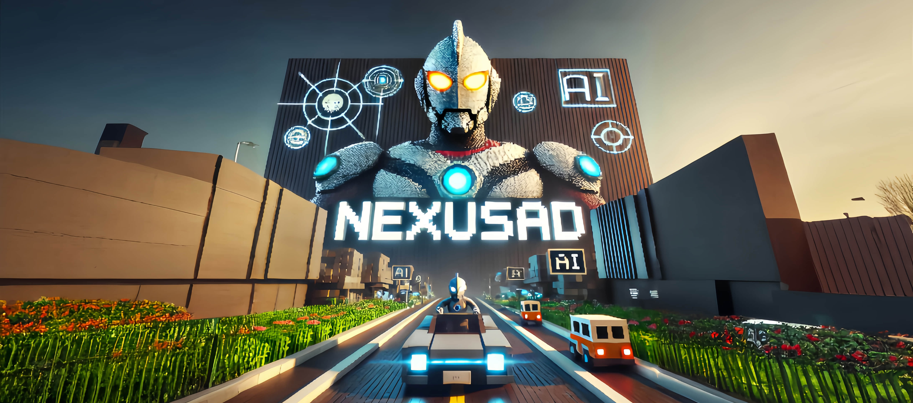
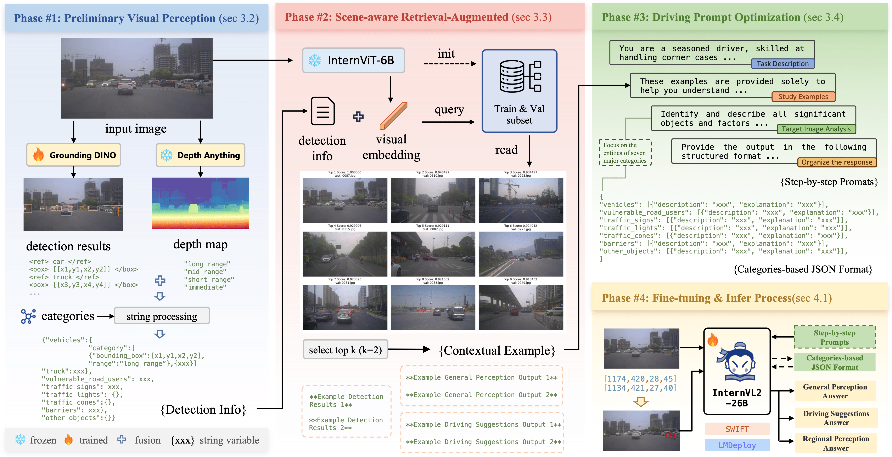

  

# **🚗 NexusAD**  
*Exploring the Nexus for Multimodal Perception and Comprehension of Corner Cases in Autonomous Driving*

**⚠️ Note: The code is currently being updated, stay tuned for more features and improvements.**

`ECCV 2024 Autonomous Driving Workshop` **Corner Case Scene Understanding** [Leaderboard](https://eccv2024.autonomousdriving.com)  
**W-CODA 2024 Challenge** [Track 1](https://coda-dataset.github.io/w-coda2024/track1/)

---

---

## ✍️ Authors 

- Mengjingcheng Mo, Jingxin Wang, Like Wang, Haosheng Chen, Changjun Gu, Jiaxu Leng, Xinbo Gao  
  Chongqing University of Posts and Telecommunications

---

## 🌟 Project Highlights 

- 🔥 **NexusAD** introduces a multimodal perception and understanding framework based on **InternVL-2.0**, significantly improving detection, depth estimation, and reasoning abilities for complex scenarios through fine-tuning on the **CODA-LM** dataset.
- 🏁 **NexusAD** participated in the [**`ECCV 2024 Autonomous Driving Workshop`**](https://eccv2024.autonomousdriving.com), focusing on multimodal scene understanding tasks in extreme driving scenarios.  
  Also participated in the **[W-CODA 2024 Challenge](https://coda-dataset.github.io/w-coda2024/track1/)** Track 1.

  

---

## 📰 Latest News 

- **2024/08/15**: NexusAD was submitted to ECCV 2024 and achieved a score of 68.97.
- **2024/08/15**: The NexusAD team released the latest version of the code and LoRA weights.

---

## 🚀 Quick Start 

Follow these steps to start using NexusAD:

1. **Clone the repository**:
   %%%bash
   git clone https://github.com/OpenVisualLab/NexusAD.git
   cd NexusAD
   %%%

2. **Install dependencies**:
   %%%bash
   pip install -r requirements.txt
   %%%

3. **Download the [CODA-LM Dataset](https://example.com/coda-lm-dataset)** and place it in the specified directory.

4. **Download the [LoRA Weights](https://example.com/lora-weights)** and place them in the `weights/` directory.

5. **Run the model**:
   %%%bash
   python preprocess.py --data_path <path-to-CODA-LM>
   python train.py --config config.json
   python evaluate.py --data_path <path-to-evaluation-set>
   %%%

---

## ⚙️ Model Architecture 

The NexusAD model architecture consists of the following components:

1. **Preliminary Visual Perception**: Uses **Grounding DINO** for object detection and **DepthAnything v2** for depth estimation, transforming spatial information into easily understandable structured text.
   
2. **Scene-aware Enhanced Retrieval Generation**: Utilizes **Retrieval-Augmented Generation (RAG)** to retrieve and select relevant samples, enhancing understanding of complex driving scenarios.

3. **Driving Prompt Optimization**: Uses **Chain-of-Thought (CoT)** prompting to generate context-aware, structured driving suggestions.

4. **Fine-tuning**: Efficient parameter fine-tuning is performed using **LoRA** to optimize performance while saving computational resources.

---

## 📊 Experimental Results 

In the ECCV 2024 Corner Case Understanding task, NexusAD outperformed baseline models, achieving a final score of **68.97**:

| Model                | General Perception | Regional Perception | Driving Suggestions | Final Score  |
|----------------------|--------------------|---------------------|---------------------|--------------|
| GPT-4V               | 57.50              | 56.26               | 63.30               | 59.02        |
| CODA-VLM             | 55.04              | 77.68               | 58.14               | 63.62        |
| InternVL-2.0-26B     | 43.39              | 64.91               | 48.04               | 52.11        |
| **NexusAD (Ours)**   | **57.58**          | **84.31**           | **65.02**           | **68.97**    |

---

## 💡 Contribution Guidelines 

We welcome all forms of contributions! Please refer to [CONTRIBUTING.md](CONTRIBUTING.md) for details on how to participate.

---

## 📜 License & Citation 

This project is licensed under the [MIT License](./LICENSE). If you find this project helpful in your research, please cite it as follows:

%%%BibTeX
@article{mo2024nexusad,
  title={NexusAD: Multimodal Perception and Comprehension of Corner Cases in Autonomous Driving},
  author={Mo, Mengjingcheng and Wang, Jingxin and Wang, Like and Chen, Haosheng and Gu, Changjun and Leng, Jiaxu and Gao, Xinbo},
  journal={ECCV 2024 Autonomous Driving Workshop},
  year={2024}
}
%%%

---

## 🙏 Acknowledgments 

Special thanks to the following projects for providing key references and support for the development of NexusAD:

- **[InternVL](https://github.com/OpenGVLab/InternVL)**: Provided crucial technical support for the development of multimodal vision-language models.
- **[CODA-LM](https://github.com/DLUT-LYZ/CODA-LM)**: Provided datasets and resources for the corner case understanding task.

---

(<a href="#top">Back to top</a>)

